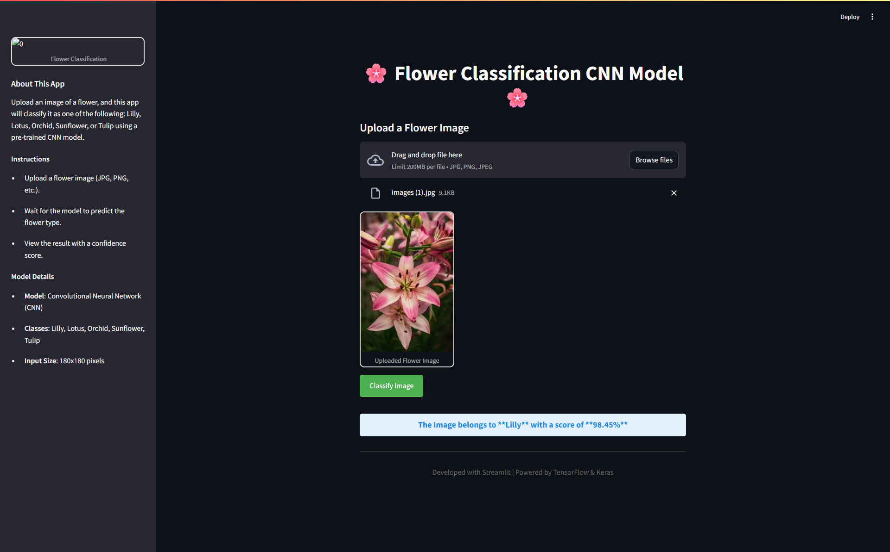

 # 🌸 Flower Classification Web App using CNN

This is a deep learning-based web application that classifies flower images into 5 categories — **Lilly, Lotus, Orchid, Sunflower, and Tulip** — using a Convolutional Neural Network (CNN). The app is built with **TensorFlow**, **Keras**, and **Streamlit**.

  

---

## 📸 Demo

Upload a flower image, click on **Classify Image**, and get the prediction result with confidence score.

---

## 🚀 Features

- 📷 Upload flower image (JPG/PNG)
- 🔍 Predict flower category using CNN model
- 📊 Shows prediction confidence
- 💻 Built with Streamlit for interactive UI
- 🎨 Image augmentation for robust model

---

## 🧠 What I Learned

- Implementing Convolutional Neural Networks (CNN) in TensorFlow/Keras  
- Preprocessing images using `image_dataset_from_directory()`  
- Applying **Data Augmentation** techniques like flip, rotate, zoom  
- Building a web UI using **Streamlit**  
- Deploying and saving models using `.h5` format  
- Visualizing predictions and confidence scores

---

## 🛠️ Technologies Used

- Python 🐍  
- TensorFlow & Keras  
- Streamlit  
- NumPy, Matplotlib  
- Git, GitHub  

---

## 📁 Project Structure

